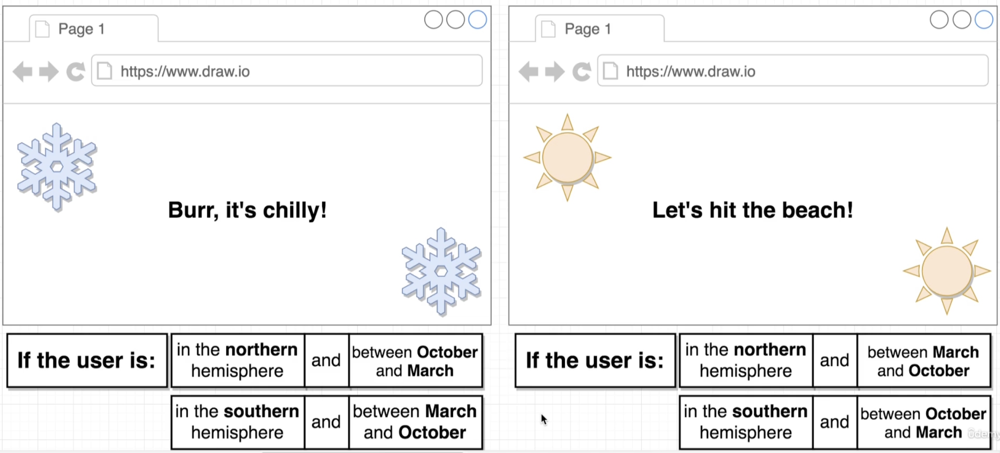

## Seasons App

### App Overview

### App Challenges

* Get users' physical location
* Determine the current month
* Change text and styling based on location + month

### Skills Covered

* Class-based components
* States
* Lifecycle methods
* Conditional rendering

### Additional Instructions

1. To check if Semantic UI is loading correctly, navigate to `inspect` - `network`, then refresh the page to see the files loaded;
2. To play with 2 different versions of view rendering, navigate to `inspect` - `...` - `sensors` to change geolocation.
